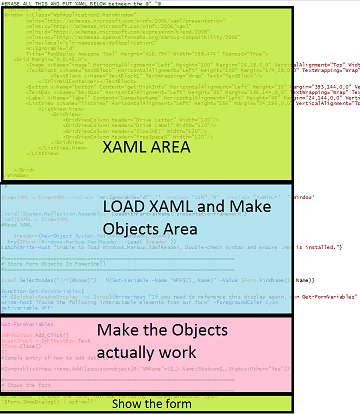

# PowerShell_XAML
The new home of the PowerShell XAML loader Snippet for easy GUIs

###What is this?
Wanna copy-paste XAML into your PowerShell scripts for an easy-peasy GUI?  This is the code for you.

This Snippet is made to simplify the task of creating a GUI using Visual Studio, and then importing it's XAML code into PowerShell for simple GUIs.  A full walkthrough of this process is  [available here, under **XAML and Visual Studio**.](http://foxdeploy.com/resources/learning-gui-toolmaking-series/)

###How to use it

* Copy-Paste this code into the ISE and hit F5 to Run it
* Install Visual Studio 2013 or higher
* Make a WPF/C# Application
* Create a GUI to fit code you already have
* Copy the XAML code from the editor window in Visual Studio
* In the ISE, hit Control+J to load the Snippet menu, then find 'XAML' in the list, and hit enter
* Paste the XAML code into the first lines of, between $XAMl= @"  "@

###What does it do?
This snippet will scan through the XAML code and creat PowerShell Objects associated with every interactable element on the screen. We can now make changes to these things with code, just by changing their objects. 

First time running of a GUI will generate this output 

You can run it again later if you forget the variable names by running Get-FormVariables, which is a small helper function embedded in the snippet.

To make the elements on your GUI work, you'll need to add code to them, beginning with lines 51-63, this is titled the 'Make the objects actually work' area.    

You'll find examples of how to do this already within the snippet.

###I still don't get it
If this is confusing, please consult the [full step-by-step walkthrough]](http://foxdeploy.com/resources/learning-gui-toolmaking-series/) found on [FoxDeploy.com](http://www.foxdeploy.com).  Alternately, e-mail me at Stephen@Foxdeploy.com.

